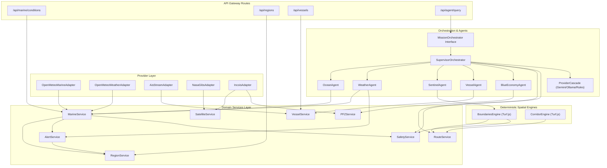

# AUREXO — BACKEND CONTRACT & ARCHITECTURAL AUDIT
**SIH 2026 Problem Statement PS-176 — Autonomous Marine Intelligence Platform**  
*Document Version: 1.0.0 — Frozen Frontend Contract Alignment*  
*Timestamp: September 2026*

---

## 1. Executive Context & Core Directives

The Aurexo frontend interface is **FROZEN**. The UI layout, components (`MarineMap`, `MarineHUD`, `ChatDrawer`, `AgentInspector`, `LayerController`), and user-facing page routes (`/`, `/dashboard`, `/fleet`, `/regions`, `/analytics`, `/about`) are locked against changes.

### The Non-Negotiable Axiom:
$$\textbf{ONE FACT} \longrightarrow \textbf{ONE CANONICAL DOMAIN OBJECT} \longrightarrow \textbf{MANY PROJECTIONS}$$

1. **No Duplication:** Calculations (distances, risk scores, bearings, safety levels) must execute in exactly one authoritative backend engine. No React-side or agent-side re-computation.
2. **Zero Mocks:** No fake numbers, simulated vessel coordinates, or phantom cyclone bulletins. Broken or unauthenticated external APIs degrade honestly to `UNAVAILABLE`.
3. **No LLM Hallucinated Math:** Spatial distances, coordinates, depths, boundary intersections, and safety thresholds are computed 100% deterministically by domain engines prior to LLM narrative generation.
4. **Interface Decoupling:** Provider-specific response shapes (Open-Meteo, NASA GIBS, AISStream) never bleed into frontend DTOs or agent memory. They are validated and normalized by dedicated Provider Adapters.

---

## 2. Canonical Domain Models

All domain logic must operate upon these canonical types, situated in `src/lib/domain/models.ts`:

### 2.1. `GeoCoordinate` & `BoundingBox`
```typescript
export interface GeoCoordinate {
  latitude: number;   // -90.0 to 90.0 (WGS-84)
  longitude: number;  // -180.0 to 180.0 (WGS-84)
}

export interface BoundingBox {
  minLat: number;
  maxLat: number;
  minLon: number;
  maxLon: number;
}
```

### 2.2. `MarineObservation` & `MarineForecast`
```typescript
export interface WaveMetrics {
  heightMeters: number;       // Significant wave height (Hs)
  directionDegrees: number;   // Mean wave direction (0-360°)
  periodSeconds: number;      // Peak period (Tp)
  category: 'Calm' | 'Moderate' | 'Rough' | 'Very Rough' | 'Phenomenal';
}

export interface WindMetrics {
  speedKmh: number;
  gustsKmh: number;
  directionDegrees: number;
  beaufortScale: number;      // 0 to 12
  beaufortDescription: string;
}

export interface CurrentMetrics {
  velocityKmh: number;        // Ocean surface drift speed
  directionDegrees: number;
}

export interface DataProvenance {
  provider: string;           // e.g. 'Open-Meteo', 'AISStream', 'INCOIS'
  endpoint?: string;
  retrievalTimestamp: string; // ISO 8601 when fetched by Aurexo
  observationTimestamp: string; // ISO 8601 timestamp of measurement
  verificationStatus: 'VERIFIED_LIVE' | 'VERIFIED_LOCAL' | 'DOCUMENTED_UNVERIFIED' | 'UNAVAILABLE';
}

export interface MarineObservation {
  id: string;
  coordinate: GeoCoordinate;
  locationName: string;
  wave: WaveMetrics;
  wind: WindMetrics;
  currents: CurrentMetrics;
  seaSurfaceTemperatureCelsius: number;
  isSafeForSmallCraft: boolean;
  advisoryText: string;
  provenance: DataProvenance;
}

export interface MarineForecastPoint {
  timestamp: string;
  waveHeightMeters: number;
  windSpeedKmh: number;
  gustsKmh: number;
  temperatureCelsius: number;
}

export interface MarineForecast {
  coordinate: GeoCoordinate;
  locationName: string;
  generatedAt: string;
  hourly: MarineForecastPoint[];
  provenance: DataProvenance;
}
```

### 2.3. `Vessel` & `VesselPosition`
```typescript
export type VesselType =
  | 'Artisanal Fishing'
  | 'Deep-Sea Trawler'
  | 'Research Vessel'
  | 'Coast Guard Patrol'
  | 'Cargo / Tanker';

export type VesselRegistrationSource = 'AIS' | 'USER_REGISTERED';
export type VesselDataLiveness = 'LIVE' | 'STALE' | 'UNAVAILABLE';

export interface VesselPosition {
  coordinate: GeoCoordinate;
  speedKnots: number;
  headingDegrees: number;
  timestamp: string;
}

export interface Vessel {
  id: string;
  mmsi: string;
  name: string;
  callsign: string;
  vesselType: VesselType;
  position: VesselPosition;
  destination: string;
  draftMeters: number;
  lengthMeters: number;
  source: VesselRegistrationSource;
  liveness: VesselDataLiveness;
  lastUpdated: string;
  notes?: string;
}

export interface NearestVesselResult {
  vessel: Vessel;
  distanceKm: number;
  distanceNauticalMiles: number;
  bearingDegrees: number;
}
```

### 2.4. `Region` & `RegionalState`
```typescript
export interface RegionMetadata {
  id: string;
  name: string;
  state: string;
  sea: 'Arabian Sea' | 'Bay of Bengal' | 'Indian Ocean' | 'Lakshadweep Sea' | 'Andaman Sea';
  center: GeoCoordinate;
  boundingBox: BoundingBox;
  primaryPorts: string[];
  vulnerableHazards: string[];
  description: string;
}

export interface RegionalState {
  region: RegionMetadata;
  observation: MarineObservation;
  activeAlerts: MarineAlert[];
  isSeaRough: boolean;
  evaluatedAt: string;
}
```

### 2.5. `MarineAlert`
```typescript
export type AlertSeverity = 'Advisory' | 'Watch' | 'Warning' | 'Emergency';
export type AlertHazardType = 'High Wave' | 'Rough Sea' | 'Cyclone' | 'Squall' | 'Swell Surge';

export interface MarineAlert {
  id: string;
  severity: AlertSeverity;
  hazardType: AlertHazardType;
  affectedRegion: string;
  headline: string;
  description: string;
  issuedAt: string;
  validUntil: string;
  recommendedAction: string;
  provenance: DataProvenance;
}
```

### 2.6. `PFZAdvisory`
```typescript
export interface PFZZone {
  id: string;
  name: string;
  coordinate: GeoCoordinate;
  distanceFromCoastKm: number;
  depthMeters: number;
  targetSpecies: string[];
  chlorophyllStatus: string;
}

export interface PFZAdvisory {
  sector: string;
  zones: PFZZone[];
  guidance: string;
  provenance: DataProvenance;
}
```

### 2.7. `GeofenceResult` & `RouteResult`
```typescript
export type GeofenceRiskStatus =
  | 'Safe'
  | 'Caution'
  | 'Border Proximity Warning'
  | 'Restricted Zone Violation';

export interface GeofenceResult {
  coordinate: GeoCoordinate;
  isInsideEEZ: boolean;
  distanceToIMBLKm: number;
  nearestNeighborCountry: string;
  isInsideMarineProtectedArea: boolean;
  protectedAreaName?: string;
  riskStatus: GeofenceRiskStatus;
  notes: string;
}

export interface RoutePassageWaypoint {
  coordinate: GeoCoordinate;
  distanceFromOriginKm: number;
  geofenceCheck: GeofenceResult;
}

export interface RouteResult {
  origin: GeoCoordinate;
  destination: GeoCoordinate;
  originName: string;
  destinationName: string;
  totalDistanceKm: number;
  estimatedTravelTimeHours: number;
  waypoints: RoutePassageWaypoint[];
  routeGeometry: GeoJSON.LineString;
  overallSafety: 'Safe' | 'Caution' | 'High Risk';
  advisory: string;
}
```

### 2.8. `SafetyAssessment`
```typescript
export type UnifiedRiskLevel = 'Minimal Risk' | 'Caution' | 'Hazardous' | 'Critical Danger';

export interface SafetyFactorScore {
  name: 'Wave Severity' | 'Wind Hazard' | 'Border Proximity' | 'Restricted Zone Infringement';
  rawScore: number; // 0 to 100
  weight: number;   // 0.0 to 1.0
  weightedScore: number;
  description: string;
}

export interface SafetyAssessment {
  coordinate: GeoCoordinate;
  compositeRiskScore: number; // 0 (calm/safe) to 100 (extreme danger)
  riskLevel: UnifiedRiskLevel;
  primaryRiskFactor: string;
  factors: SafetyFactorScore[];
  smallCraftAdvisory: boolean;
  recommendedAction: string;
  evaluatedAt: string;
}
```

### 2.9. `AgentExecutionTrace` & `SessionState`
```typescript
export interface AgentExecutionStep {
  agent: 'Supervisor' | 'Ocean' | 'WeatherHazard' | 'SpatialSentinel' | 'Vessel' | 'BlueEconomy';
  action: string;
  toolUsed?: string;
  status: 'executing' | 'completed' | 'flagged';
  durationMs: number;
  summary: string;
  timestamp: string;
}

export interface AgentExecutionTrace {
  steps: AgentExecutionStep[];
  totalDurationMs: number;
  consensusSummary: string;
}

export interface SessionState {
  sessionId?: string;
  lastCoordinates?: GeoCoordinate;
  lastLocationName?: string;
  lastActiveLayer?: string;
  updatedAt: string;
}
```

---

## 3. Provider Layer Inventory

| Provider Adapter | Target External System | Protocol | Authenticated | Output Canonical Model | Error Mapping |
| :--- | :--- | :--- | :--- | :--- | :--- |
| **`OpenMeteoMarineAdapter`** | `marine-api.open-meteo.com/v1/marine` | HTTPS REST | No (Public) | `WaveMetrics`, `seaSurfaceTemperatureCelsius` | `TIMEOUT`, `INVALID_RESPONSE`, `PROVIDER_UNAVAILABLE` |
| **`OpenMeteoWeatherAdapter`** | `api.open-meteo.com/v1/forecast` | HTTPS REST | No (Public) | `WindMetrics` | `TIMEOUT`, `INVALID_RESPONSE`, `PROVIDER_UNAVAILABLE` |
| **`AisStreamAdapter`** | `wss://stream.aisstream.io/v0/stream` | Secure WSS | Yes (`AISSTREAM_API_KEY`) | `Vessel[]`, `VesselPosition` | `AUTH_FAILED`, `TIMEOUT`, `INVALID_RESPONSE`, `PROVIDER_UNAVAILABLE` |
| **`NasaGibsAdapter`** | `gibs.earthdata.nasa.gov` | WMS/WMTS | No (Public) | `SatelliteLayerConfig` | `UNSUPPORTED`, `PROVIDER_UNAVAILABLE` |
| **`IncoisAdapter`** | `incois.gov.in/geoserver` | WMS 1.1.1 | No (Public) | `SatelliteLayerConfig`, `PFZAdvisory` | `TIMEOUT`, `PROVIDER_UNAVAILABLE` |
| **`ImdAdapter`** | IMD Public Bulletins | REST / WMS | No (Restricted) | `MarineAlert[]` | `AUTH_FAILED` $\rightarrow$ marks `UNAVAILABLE` |

### Provider Error Taxonomy
```typescript
export type ProviderErrorCode =
  | 'TIMEOUT'
  | 'RATE_LIMITED'
  | 'AUTH_FAILED'
  | 'INVALID_RESPONSE'
  | 'PROVIDER_UNAVAILABLE'
  | 'DATA_STALE'
  | 'UNSUPPORTED';

export class ProviderError extends Error {
  constructor(
    public readonly code: ProviderErrorCode,
    public readonly provider: string,
    message: string,
    public readonly originalError?: unknown
  ) {
    super(`[${provider}] ${code}: ${message}`);
    this.name = 'ProviderError';
  }
}
```

---

## 4. Service Layer Inventory

```
                  ┌──────────────────────────────────────────────┐
                  │                API GATEWAY                   │
                  │   (/api/marine/conditions, /api/regions,     │
                  │    /api/vessels, /api/agent/query)           │
                  └──────────────────────┬───────────────────────┘
                                         │
        ┌────────────────────────────────┼────────────────────────────────┐
        ▼                                ▼                                ▼
┌─────────────────┐            ┌───────────────────┐            ┌──────────────────┐
│  MarineService  │            │   VesselService   │            │  RegionService   │
└───────┬─────────┘            └─────────┬─────────┘            └────────┬─────────┘
        │                                │                               │
        ├────────────────────────────────┼───────────────────────────────┤
        ▼                                ▼                               ▼
┌─────────────────┐            ┌───────────────────┐            ┌──────────────────┐
│  AlertService   │            │   RouteService    │            │  SafetyService   │
└───────┬─────────┘            └─────────┬─────────┘            └────────┬─────────┘
        │                                │                               │
        └────────────────────────────────┴───────────────────────────────┘
                                         │
                                         ▼
                     ┌───────────────────────────────────────┐
                     │          MissionOrchestrator          │
                     │          (Multi-Agent Core)           │
                     └───────────────────────────────────────┘
```

1. **`MarineService`**:
   * Fetches, validates, and normalizes wave, wind, currents, and SST into canonical `MarineObservation`.
   * Manages in-memory LRU observation cache with 10-minute TTL to prevent rate limit exhaustion.
2. **`VesselService`**:
   * Consumes `AisStreamAdapter` WebSocket buffer.
   * Manages unified vessel catalog: real AIS stream vessels (`source: 'AIS'`) and user-registered craft (`source: 'USER_REGISTERED'`).
   * Provides deterministic spatial nearest-neighbor search (`findNearestVessel`).
3. **`RegionService`**:
   * Authoritative store for 9 coastal maritime sectors and port alias resolutions.
   * Scans regional warnings by joining sector centroids to `MarineService` and `AlertService`.
4. **`AlertService`**:
   * Evaluates deterministic hazard thresholds (high wave $\ge 2.5\text{m}$, squall gusts $\ge 45\text{km/h}$).
   * Appends honest IMD programmatic feed status (`status: 'UNAVAILABLE'`).
5. **`PFZService`**:
   * Authoritative source for Potential Fishing Zones, chlorophyll fronts, and species advisories.
6. **`RouteService`**:
   * Deterministic great-circle navigation between multi-port endpoints.
   * Waypoint geofencing against IMBL borders and Marine Protected Areas (MPAs).
7. **`SafetyService`**:
   * Computes composite 0-100 risk score and unified risk level.
   * Executes safety veto logic when environmental risk overrides commercial fishing advisories.
8. **`SatelliteService`**:
   * Single source of truth for NASA GIBS (TrueColor, SST, Chlorophyll-A) and INCOIS (Coral Reefs, PFZ) layer metadata and tile URLs.

---

## 5. API Mapping (Frontend Contracts to Backend Services)

| Frontend Route & Call | API Gateway Route | Backend Service Responsible | Canonical Model Returned |
| :--- | :--- | :--- | :--- |
| **Hero & HUD ticker** | `GET /api/marine/conditions?lat=&lon=` | `MarineService.getConditions()` | `MarineObservation` projection |
| **Regions Grid** | `GET /api/regions` | `RegionService.getAllRegions()` | `RegionMetadata[]` projection |
| **Regions Active Scan** | `GET /api/regions?scan=warnings` | `RegionService.scanActiveWarnings()` | `RegionalState[]` projection |
| **Fleet Tracking** | `GET /api/vessels` | `VesselService.getAllVessels()` | `Vessel[]` projection + AIS telemetry |
| **Nearest Vessel** | `GET /api/vessels?nearLat=&nearLon=` | `VesselService.findNearest()` | `NearestVesselResult` projection |
| **Register Vessel** | `POST /api/vessels` | `VesselService.registerVessel()` | `Vessel` (created) |
| **Ask Aurexo Copilot** | `POST /api/agent/query` | `MissionOrchestrator.dispatch()` | `AgentResponse` projection |

---

## 6. Duplication Risks & Current Inconsistencies Identified

### Inconsistency 1: Vessel Status Enumeration
* **Problem**: `domain.ts` and `vessel.ts` had references to `SIMULATED_TEST`.
* **Resolution**: Purged. Canonical status strictly uses:
  * `source`: `'AIS' | 'USER_REGISTERED'`
  * `liveness`: `'LIVE' | 'STALE' | 'UNAVAILABLE'`

### Inconsistency 2: Coordinate Object Property Naming
* **Problem**: Some files used `coordinate: { latitude, longitude }` while others used `coordinates` or flat `lat, lon`.
* **Resolution**: Standardized across the entire backend on `GeoCoordinate { latitude: number; longitude: number }`.

### Inconsistency 3: Open-Meteo Client Duplication
* **Problem**: `marine-conditions.ts` and `regions.ts` were both issuing raw HTTP requests to Open-Meteo.
* **Resolution**: All Open-Meteo requests routed through `OpenMeteoMarineAdapter` and `OpenMeteoWeatherAdapter` with central caching in `MarineService`.

### Inconsistency 4: Scattered Geofence Logic
* **Problem**: `boundaries.ts`, `routes.ts`, and `safety-engine.ts` each had slightly varying threshold buffers for IMBL distance.
* **Resolution**: Unified in `src/lib/geo/boundaries.ts` as the single authoritative spatial engine, consumed by `RouteService` and `SafetyService`.

### Inconsistency 5: Telemetry Trace Exposure
* **Problem**: `swarmTrace` previously exposed internal strings without standard schema.
* **Resolution**: Standardized into `AgentExecutionTrace` containing concise, non-confidential telemetry (`agent`, `action`, `toolUsed`, `durationMs`, `status`, `summary`).

---

## 7. Dependency Graph



---

## 8. Implementation Order & Execution Plan

To execute this hardening with zero regressions, the implementation proceeds in 6 sequential phases:

### Phase 1: Canonical Domain Layer (`src/lib/domain/`)
* Create `src/lib/domain/models.ts` with all 13 canonical domain models.
* Create `src/lib/domain/errors.ts` with typed `ProviderError` and error taxonomy.

### Phase 2: Provider Adapters (`src/lib/providers/`)
* Implement `OpenMeteoMarineAdapter` and `OpenMeteoWeatherAdapter` with strict Zod response validation.
* Refactor `AisStreamAdapter` using existing credentials and Node 24 Blob WebSocket decoding.
* Implement `NasaGibsAdapter` and `IncoisAdapter` for WMS/WMTS layer metadata.

### Phase 3: Domain Services Layer (`src/lib/services/`)
* Implement `MarineService` with caching.
* Implement `VesselService` with AIS stream + user-registered fleet management.
* Implement `RegionService` with clean separation of metadata, telemetry, and warnings.
* Implement `AlertService`, `PFZService`, `RouteService`, `SafetyService`, and `SatelliteService`.

### Phase 4: Mission Orchestration & Agent Alignment (`src/lib/orchestrator/`)
* Define `interface MissionOrchestrator`.
* Update `SupervisorOrchestrator` to coordinate exclusively via domain services.
* Ensure agents do NOT make raw HTTP calls or calculate spatial math independently.
* Sanitize `AgentExecutionTrace` to expose clean execution telemetry without private LLM thoughts.

### Phase 5: API Gateway Refactoring (`src/app/api/`)
* Refactor `/api/marine/conditions` to call `MarineService`.
* Refactor `/api/regions` to call `RegionService`.
* Refactor `/api/vessels` to call `VesselService`.
* Refactor `/api/agent/query` to call `MissionOrchestrator`.

### Phase 6: Full Verification & Test Validation
* Update test suites to assert against canonical services.
* Execute `npm run lint`, `npx tsc --noEmit`, `npm test`, and `npm run build`.
* Verify end-to-end browser-to-backend flows on every route.
