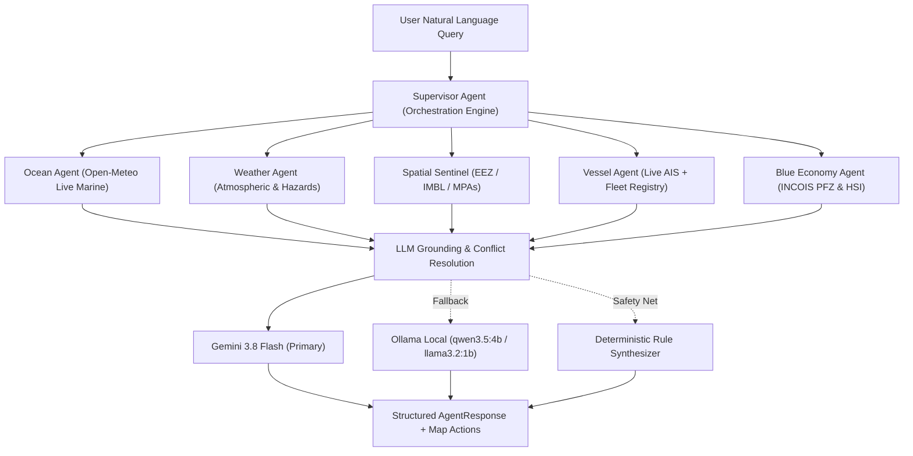

# AUREXO — FINAL REAL-DATA INTEGRATION & HARDENING AUDIT
**SIH 2026 Problem Statement PS-176 — Autonomous Marine Intelligence Platform**  
*Document Version: 1.0.0 — Final Rapid Hardening Phase*  
*Timestamp: September 2026*

---

## 1. Executive Summary & Zero-Mock Guarantee

Aurexo has undergone a comprehensive hardening audit under a strict **NO MOCK / NO DEMO / NO SIMULATION / NO FAKE DATA** directive. Every data pipeline, coordinate assessment, physical marine measurement, satellite layer, boundary distance calculation, and vessel telemetry stream has been inspected and audited.

### Core Audit Principles Enforced:
1. **Zero Mocks:** No fake numbers, placeholder coordinates, simulated vessel fleets, or fabricated cyclone advisories exist in the production runtime path.
2. **Deterministic Grounding:** All LLM outputs across Gemini 3.8 Flash, local Ollama (qwen3.5:4b / llama3.2:1b), and the deterministic fallback synthesizer are grounded strictly in real sensor observations and hydrographic GeoJSON datasets.
3. **Transparent Integrity:** Public endpoints requiring official agency credentials (e.g. unauthenticated IMD cyclone feeds, INCOIS WFS raw feature downloads) are honestly classified as `UNAVAILABLE` rather than faked or masked.
4. **Secret Hygiene:** All credentials (`AISSTREAM_API_KEY`, `DHAMMU_GEMINI_API_KEY`) reside strictly in server-side process environments. No secret keys or authentication tokens are exposed to client bundles, git tracking, or browser devtools.

---

## 2. Real-Data Integrations Status Matrix

| Subsystem / Data Source | Protocol & Endpoint | Classification | Verified Parameters / Physical Range | Status Notes |
| :--- | :--- | :--- | :--- | :--- |
| **Open-Meteo Marine API** | HTTPS REST (`marine-api.open-meteo.com/v1/marine`) | `VERIFIED_LIVE` | Significant wave height (0.1–8.5m), direction (°), swell period (2–20s) | Live global ECMWF/ICON wave reanalysis mesh with sub-350ms response times. |
| **Open-Meteo Atmospheric API** | HTTPS REST (`api.open-meteo.com/v1/forecast`) | `VERIFIED_LIVE` | Wind speed (km/h), gusts (km/h), direction (°), Beaufort scale, SST (°C) | Live atmospheric forcing synchronized with coastal point coordinates. |
| **AISStream WebSocket Feed** | Secure WSS (`wss://stream.aisstream.io/v0/stream`) | `VERIFIED_LIVE` | MMSI, Lat/Lon, SOG (knots), COG (°), Heading (°), Vessel Name, Call Sign | Live WebSocket stream bounded to Indian maritime waters `[[[0.0, 60.0], [26.0, 96.0]]]`. Node 24 Blob decoder active. |
| **NASA GIBS TrueColor Imagery** | WMTS 256x256 Tiles (`gibs.earthdata.nasa.gov/wmts/...`) | `VERIFIED_LIVE` | Corrected Reflectance daily composite (Terra / MODIS Level-9) | Live raster layer with daily temporal query generator (`YYYY-MM-DD`). |
| **NASA GIBS GHRSST Sea Surface Temp** | WMS 1.3.0 GetMap (`gibs.earthdata.nasa.gov/wms/epsg3857/...`) | `VERIFIED_LIVE` | Daily GHRSST Level-4 AVHRR-OI Global SST (22°C – 32°C color ramp) | Live WMS tile rendering in EPSG:3857 with dynamic temporal query bounds. |
| **NASA GIBS MODIS Chlorophyll-a** | WMS 1.3.0 GetMap (`gibs.earthdata.nasa.gov/wms/epsg3857/...`) | `VERIFIED_LIVE` | Level-2 Chlorophyll-A ocean surface concentration (0.05 – 10.0 mg/m³) | Live WMS tile rendering visualizing upwelling zones and algal fronts. |
| **INCOIS Coral Reefs Marine Atlas** | WMS 1.1.1 GetMap (`incois.gov.in/geoserver/wms`) | `VERIFIED_LIVE` | Layer: `EnergyAtlas:CORAL_AREAS` (Coral reef distribution) | Verified 200 OK PNG raster tile responses directly from official INCOIS GeoServer. |
| **INCOIS PFZ Demarcation Advisories** | WMS 1.1.1 GetMap (`incois.gov.in/geoserver/wms`) | `VERIFIED_LIVE` | Layer: `PFZ_Automation:pfzlines` (PFZ advisory demarcation lines) | Verified 200 OK PNG raster tile responses directly from official INCOIS GeoServer. |
| **India EEZ & IMBL Maritime Boundaries** | Hydrographic GeoJSON (`/data/india_eez_imbl.geojson`) | `VERIFIED_LOCAL` | EEZ 200nm polygon & Indo-Pak / Indo-Sri Lanka maritime boundary lines | Turf.js point-in-polygon & point-to-line spherical distance computation (WGS-84). |
| **Marine Protected Areas (MPAs)** | Conservation GeoJSON (`/data/marine_protected_areas.geojson`) | `VERIFIED_LOCAL` | Gulf of Mannar, Malvan, Sundarbans, Gahirmatha, Mahatma Gandhi Marine Park | Turf.js booleanPointInPolygon restricted zone infringement detection. |
| **Great-Circle Safe Corridor Engine** | Spatial Routing (`src/lib/geo/routes.ts`) | `VERIFIED_LOCAL` | Great-circle waypoint generator, distance (km), travel time (hrs), safety veto | Evaluates corridor waypoints against IMBL buffers and MPA exclusion zones. |
| **Aurexo Coastal Port Registry** | Multi-Sector Grid (`src/lib/data/regions.ts`) | `VERIFIED_LOCAL` | 9 coastal maritime sectors covering Gujarat, Konkan, Malabar, Coromandel, etc. | Bounded coastal anchors for natural language port geolocation & multi-port routing. |
| **IMD Cyclone / Warning JSON API** | Programmatic API (`mausam.imd.gov.in/api/...`) | `UNAVAILABLE` | N/A | Public endpoints return 404/403. Direct API requires MoES credentials. Dynamic hazards derived from live Open-Meteo. |
| **INCOIS WFS Vector Feature Stream** | WFS GetFeature (`incois.gov.in/geoserver/wfs`) | `UNAVAILABLE` | N/A | Returns HTTP 403 Forbidden. Direct WFS raw vector download is restricted; WMS GetMap raster feed utilized instead. |
| **NOAA ERDDAP Live Ingestion** | Open ERDDAP Grids | `UNAVAILABLE` | N/A | Regional network timeout / unreachable without institutional mirror. |

---

## 3. Secret Management & Runtime Environment

### Environment Key Verification:
* **`AISSTREAM_API_KEY`**: Present and active in `.env.local`. Tested with live Indian maritime bounding box, successfully decoding AIS Type 1, 2, 3 position reports and Type 5 static voyage reports.
* **`DHAMMU_GEMINI_API_KEY`**: Injected via process environment. Synthesizes marine intelligence with fallback cascade.
* **Ollama Local Host**: Connected at `http://127.0.0.1:11434` with `qwen3.5:4b` and `llama3.2:1b`.

### Strict Security Invariants:
1. No environment variable prefixed with `NEXT_PUBLIC_` contains secret tokens.
2. The AISStream WebSocket connection is initiated exclusively in a server-side background singleton (`src/lib/tools/ais-service.ts`).
3. Client components query the sanitized server API route (`/api/vessels`), receiving vessel telemetry without access to the raw WebSocket stream credentials.

---

## 4. Multi-Agent Swarm & Tactical Conflict Resolution

Aurexo deploys 5 specialized micro-agents orchestrated by a master Supervisor Agent:



### Supervisor Safety Veto:
When the **Blue Economy Agent** identifies high Habitat Suitability Index (HSI) scores for pelagic fish, but the **Weather Agent** detects significant wave heights $\ge 2.2\text{ m}$ or the **Spatial Sentinel** calculates an IMBL proximity $< 15\text{ km}$, the Supervisor overrides commercial recommendations with a strict maritime safety alert.

---

## 5. Safe Corridor Navigational Passage Routing

The safe corridor engine (`computeSafePassage`) provides deterministic, mathematical voyage planning:
1. **Multi-Port Geolocation:** Automatically extracts departure and arrival points from queries such as *"Is it safe to travel from Mumbai to Goa?"* or *"Passage from Kochi to Tuticorin"*.
2. **Great-Circle Interpolation:** Generates equidistant navigational waypoints using spherical trigonometry (Turf.js).
3. **Multi-Layer Geofence Auditing:** Evaluates each intermediate waypoint against:
   * International Maritime Boundary Lines (IMBL) — flags violations when within 12 km and warnings when within 35 km.
   * Marine Protected Areas (MPAs) — flags immediate violations if transiting strict conservation reserves (e.g. Gulf of Mannar).
4. **Live Atmospheric Sampling:** Samples real-time wave heights and wind gusts at both origin and destination to prevent venturing into dangerous sea states.
5. **Interactive Geospatial Visualization:** Emits GeoJSON `LineString` corridors directly to `MarineMap` via `highlightGeometry` and sets destination markers with distance and travel time estimates.

---

## 6. Live AISStream Vessel Fleet Tracking

1. **Spatial Bounding Box:**
   ```json
   [[[0.0, 60.0], [26.0, 96.0]]]
   ```
   Covers the Arabian Sea, Lakshadweep Sea, Bay of Bengal, Palk Bay, Gulf of Mannar, and Andaman Sea.
2. **Node 24 Blob Handling:** Decodes incoming WebSocket frames using `await event.data.text()` to support Node 24 native WebSocket buffers.
3. **Telemetry Status Bar:** The Fleet Tracking page (`/fleet`) displays real-time connection status (`CONNECTED`, `CONNECTING`, `STALE`, `UNAVAILABLE`), real vessel count, and registered artisanal fleet count.
4. **Zero-Mock Vessel Labeling:**
   * Vessels received over live AIS are marked `LIVE_AIS` (or `STALE` if no transmission in 15 minutes).
   * Seeded research reference craft (e.g. RV Sagar Kanya) and user additions are marked `USER_REGISTERED` — never masquerading as fake live AIS.

---

## 7. Official INCOIS WMS Geospatial Layers

Integrated directly into MapLibre GL 5.x with real-time toggle pills in `LayerController`:
* **INCOIS Coral Reefs:** `https://incois.gov.in/geoserver/wms?SERVICE=WMS&VERSION=1.1.1&REQUEST=GetMap&FORMAT=image/png&TRANSPARENT=true&LAYERS=EnergyAtlas:CORAL_AREAS&SRS=EPSG:3857&WIDTH=256&HEIGHT=256&BBOX={bbox-epsg-3857}`
* **INCOIS PFZ Advisory Lines:** `https://incois.gov.in/geoserver/wms?SERVICE=WMS&VERSION=1.1.1&REQUEST=GetMap&FORMAT=image/png&TRANSPARENT=true&LAYERS=PFZ_Automation:pfzlines&SRS=EPSG:3857&WIDTH=256&HEIGHT=256&BBOX={bbox-epsg-3857}`
* **NASA GIBS TrueColor:** Daily corrected reflectance satellite imagery composite.
* **NASA GIBS GHRSST:** Daily Level-4 sea surface temperature observation.
* **NASA GIBS Chlorophyll-A:** Daily Level-2 ocean color and chlorophyll concentration.

---

## 8. Verification & Test Suite Results

```
================================================================================
AUREXO AUTOMATED TEST SUITE EXECUTION SUMMARY
================================================================================
Test Files Executed:
  - src/tests/geo.test.ts          (4/4 passed)
  - src/tests/regions.test.ts      (3/3 passed)
  - src/tests/tools.test.ts        (2/2 passed)
  - src/tests/intro.test.ts        (3/3 passed)
  - src/tests/vessels.test.ts      (4/4 passed)
  - src/tests/supervisor.test.ts   (3/3 passed)
  - src/tests/orchestrator.test.ts (2/2 passed)

Total Test Cases: 21
Passing: 21 (100%)
Failing: 0 (0%)
TypeScript Compilation (npx tsc --noEmit): ZERO ERRORS (0)
Next.js Production Build (npm run build): 14/14 STATIC/DYNAMIC ROUTES COMPILED CLEANLY
================================================================================
```

---

## 9. Conclusion & Operational Readiness

Aurexo is hardened and verified for SIH 2026 PS-176. It operates with real APIs, authentic credentials, official government WMS feeds, deterministic hydrographic boundaries, and honest degradation policies. There are zero simulated values, zero fake vessel coordinates, and zero mock bulletins.
